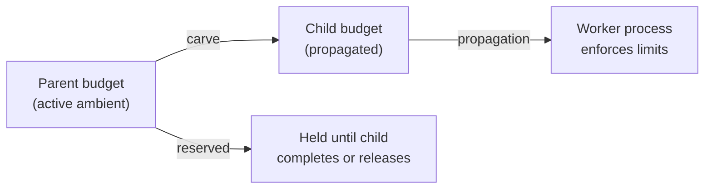

# Handles & Budgets

How to operate handles returned by `async = true` long-running calls,
and how the runtime carves parent budgets into child budgets.

## Handles

A handle is a small Lua table returned by an `async = true` dispatch:

| Field | Meaning |
|-------|---------|
| `id` | Opaque handle ID, scoped to the current runtime trace family. |
| `kind` | One of `evaluation`, `report`, `procedure`. |
| `status` | Current status snapshot at dispatch time. |
| `status_url` | Best-effort dashboard URL when available. |
| `created_at` | ISO 8601 timestamp. |
| `parent_trace_id` | The `execute_tactus` trace that created the handle. |
| `child_budget` | Carved child budget actually allocated to the worker. |

The handle store persists every handle to disk (default: next to the
Tactus trace directory). Each handle records the parent trace, original
args, dispatch result, status URL, and refreshed status data when
available.

## Lifecycle calls

### `handle.peek` / `handle.status`

```tactus
local snapshot = handle_status{ id = "<id>" }
```

Refreshes the handle from its underlying source (Evaluation record,
Task record, or process liveness) and returns the latest stored
snapshot. `peek` and `status` are aliases.

### `handle.await`

```tactus
local result = handle_await{
  id = "<id>",
  timeout = "PT10M",
}
```

Polls until the handle reaches a terminal status (`completed`,
`failed`, `cancelled`) or the ISO 8601 `timeout` elapses. The return
value mirrors `handle.peek` plus a `terminal` boolean.

### `handle.cancel`

```tactus
handle_cancel{ id = "<id>" }
```

Records cancellation intent in the handle store and propagates
cancellation to the appropriate target:

- `process_id` handles -> `SIGTERM` to the worker process.
- `task_id` handles -> dashboard Task is marked `CANCELLED`.
- evaluation handles with `evaluation_id` -> the Evaluation is marked
  `CANCELLED`.

Report and procedure workers check dashboard Task cancellation before
entering major execution phases and stop without converting
cancellation into a generic failure.

## Budget carving

When a long-running API is invoked with `async = true`, the runtime
carves the requested `budget` from the **parent** budget before
dispatch:



Carve rules:

1. Each key (`usd`, `wallclock_seconds`, `depth`, `tool_calls`) must be
   present in the requested `budget`.
2. The requested child amount must be `<= parent remaining` for every
   key. Otherwise dispatch fails with
   `error.code = "budget_exceeded"`.
3. On a successful carve, the child amount is **reserved** from the
   parent's remaining budget for the lifetime of the handle.
4. Cancelling a handle releases any unspent reserved budget back to the
   parent, but reserved-and-spent cost is not refunded.

## Propagation

How the carved child budget reaches the worker:

- **Evaluation:** `PLEXUS_CHILD_BUDGET` environment variable on the CLI
  worker. The CLI loads it via `_enforce_child_budget_from_env` and a
  cost recorder hook that rejects scorecard totals exceeding the child
  USD.
- **Report (programmatic blocks):** carried in the durable task
  metadata payload. The report-block worker enforces wallclock from the
  payload before running the block.
- **Procedure:** passed in Tactus context as `_plexus_child_budget`.
  The procedure executor extracts it, instantiates a
  `RuntimeBudgetMeter`, applies `depth` as `max_depth`, and enforces
  USD/wallclock through `record_usd` and `enforce_wallclock`.

## Inspecting your remaining budget

The response envelope's `cost` block always includes:

- `budget_remaining_usd`
- `budget_remaining_seconds`
- `budget_remaining_tool_calls`

These are the **parent** budget remainders after the current snippet's
work, including any reserved amounts held by outstanding handles.

## When to await vs poll

- Use `handle_await` when the user is waiting on the result and the
  expected wallclock fits inside a single `execute_tactus` invocation.
- Use `handle_status` (or `handle_peek`) when the user is checking on a
  long-running run between unrelated tool calls. Returning early with
  the snapshot keeps the parent budget free for other work.
- Use `handle_cancel` immediately when the user cancels or when you've
  decided the run is no longer useful (cost continues to accrue against
  the carved child budget until the worker actually exits).
